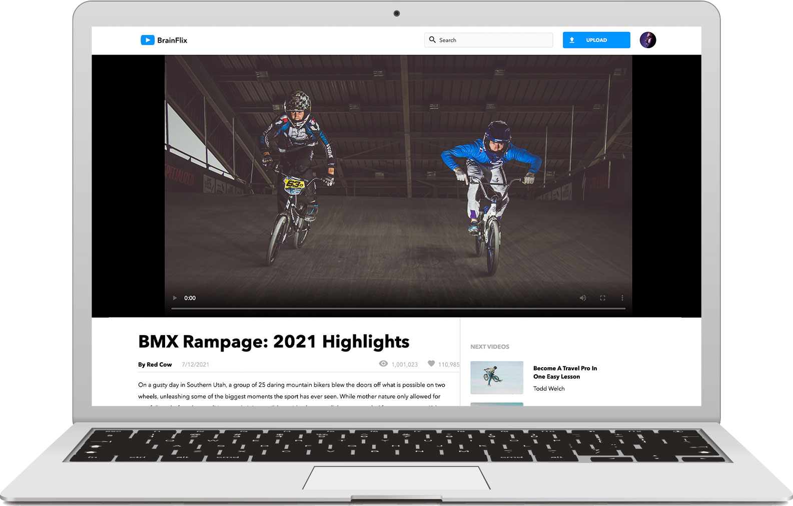

# BrainFlix

BrainFlix project was one of the assignments that I've done at BrainStation, which helped me to understand Sass(style rules, variables, mixins, and etc), Postman, API requests(with the mock API server), and much more. All pages are responsive in different breakpoints such as mobile, tablet and desktop breakpoints.

[Demo link](https://youtu.be/NcOUZOwNINQ)

[Frontend](https://github.com/jclairelee/BrainFlix) | [Backend](https://github.com/jclairelee/Brainflix-API)

## Screenshot



## Key Features

- Update Comment
- Responsibe Web Design (Media Queries)
- API

## Tech Stack Frontend

- ReactJS
- Sass

## Tech Stack Backend

- Node.js
- REST API

## Installation

### Frontend

1. Install dependencies

```bash
  npm install
```

2. Run the code

```bash
  npm start
```

### Backend

1. Install dependencies

```bash
  npm install
```

2. Run the code

```bash
npm start
```
